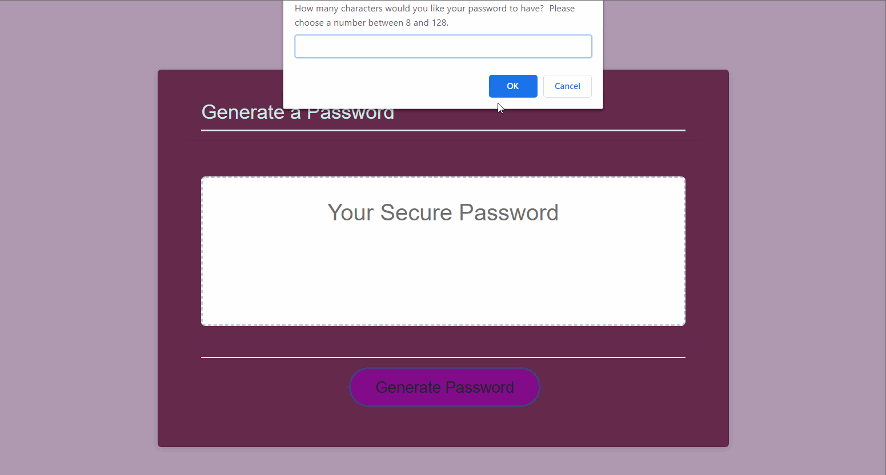

### Password Generator

This is a simple app designed to generate a password between 8-128 characters, with question prompts to determine the password length and kinds of characters to include.  At the time of creation, it was an introduction to javascript and basic functions. 

## Contents | Quick Links
[Getting Started](#start)     |     [Demo](#demo)     |     [Built With](#built)     |     [Authors](#author)     |     [Visuals](#visuals)     |     [Contributing & Tests](Contributing.md)     |     [Contact](#contact)

## [Getting Started](#start)

### View the repo and inspect the code on Git Hub here:
* [Repo URL](https://github.com/JenJayme/password-generator)

### <a id="demo">View a demo or use the app here:</a> 
* [Deployed on GitHub Page](https://jenjayme.github.io/password-generator/#demo)

## [Visuals](#visuals)

## <a id="built">Built With</a>
* HTML5 & CSS
* [Javascript](https://www.javascript.com/)
* [Bootstrap](https://getbootstrap.com/)
* [VS Code](https://code.visualstudio.com/)
* [Node.js](https://nodejs.org/)

## <a id="contact">Questions</a>
For questions or to discuss collaborations on this or other projects, contact the author via LinkedIn or GitHub as follows.

## <a id="author">Author</a>

**Jen Jayme** 
[linkedin.com/jenjayme](https://www.linkedin.com/in/jenjayme) 
[github.com/jenjayme](https://github.com/JenJayme)

## Acknowledgements
* Special thanks to Jerome Chenette, UC Berkeley Coding Boot Camp and Trilogy Education Services for referring this project.
* Shout out to Fred Rodolfo for critical advice and support.